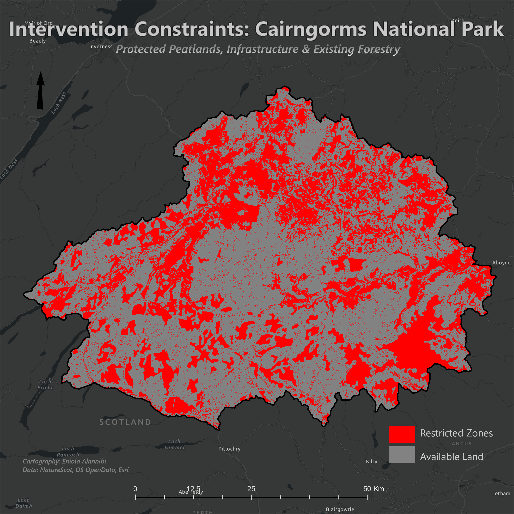
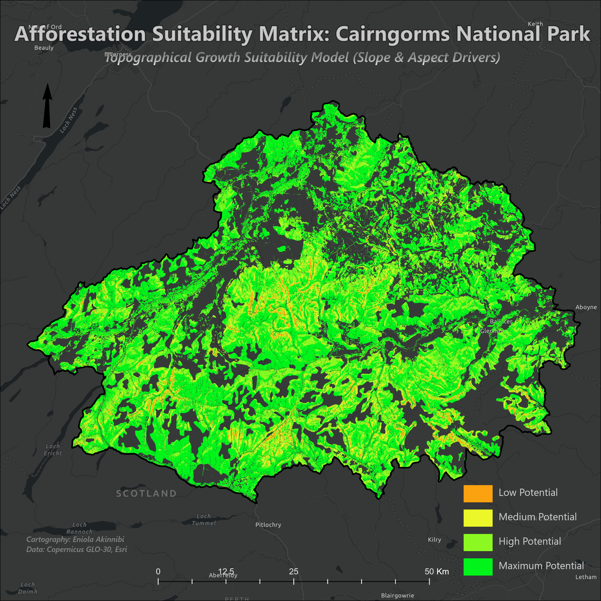
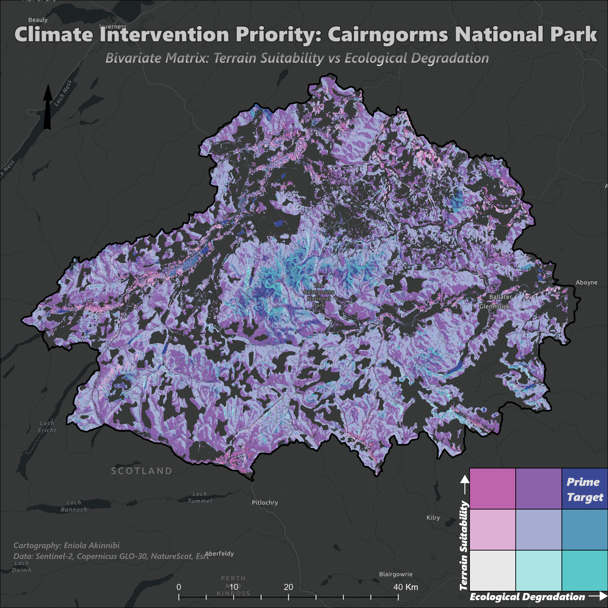
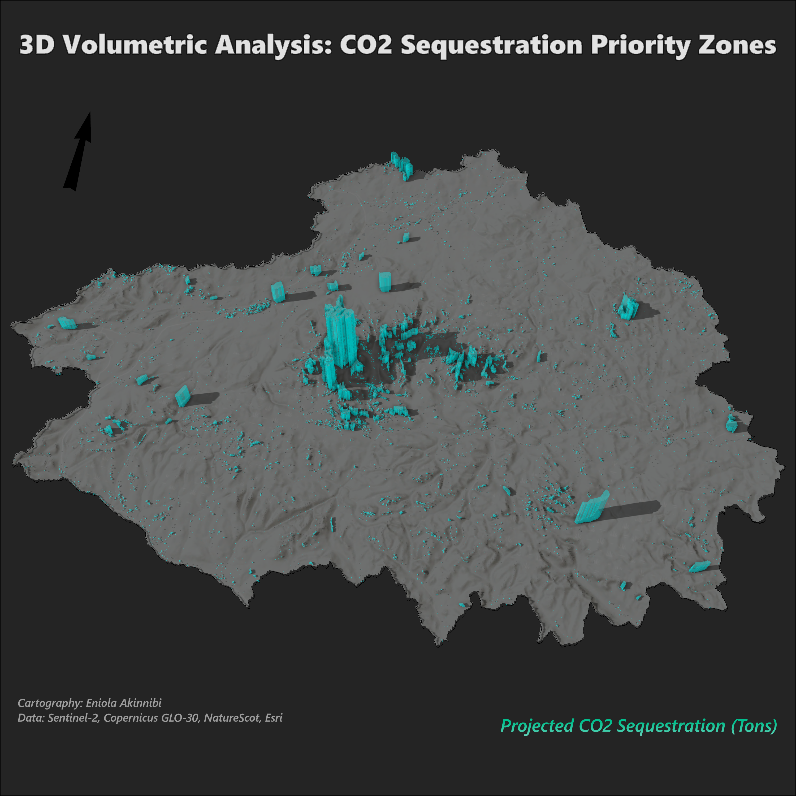

# Cairngorms Carbon Sink: Spatial Suitability and 3D Volumetric Modeling

## Project Overview
Inspired by the climate mitigation strategies of **Project Drawdown**, this spatial analysis project identifies optimal, high-yield afforestation zones within Scotland's Cairngorms National Park. Rather than randomly allocating land for tree planting, this project utilizes a multicriteria GIS workflow to pinpoint areas where *ecological need* (degraded soil) perfectly overlaps with *high physical viability* (optimal terrain for biomass growth).

The final deliverable includes a custom **Bivariate Matrix** and a **3D Volumetric Scene** calculating the exact metric tonnage of CO2 sequestration potential.

## Study Area Justification
**Cairngorms National Park, Scotland** was selected due to its massive scale and varying degrees of ecological degradation. Its complex topography provides an ideal environment to model terrain constraints against climate intervention opportunities.

## Tools and Data Sources
* **Software:** ArcGIS Pro (Spatial Analyst, 3D Analyst)
* **Elevation Data:** Copernicus GLO-30 Digital Elevation Model (DEM)
* **Multispectral Imagery:** Sentinel-2 (ESA)
* **Administrative Boundaries:** NatureScot, Esri

---

## Analytical Workflow and Map Deliverables

### 1. Ecological Degradation Baseline (NDVI)
* **Objective:** Identify land that physically needs intervention.
* **Process:** Processed Sentinel-2 multispectral imagery using the *Normalized Difference Vegetation Index (NDVI)* to separate healthy, existing forests from severely degraded or barren soils.

### 2. Strict Constraints Modeling (Boolean Mask)
* **Objective:** Ensure zero ecological disruption to existing ecosystems or human infrastructure.
* **Process:** Built a binary exclusion mask to completely remove deep peat bogs, hydrological networks, existing infrastructure, and already-healthy vegetation from the analysis.

### 3. Topographical Suitability Model
* **Objective:** Determine where trees will survive and grow the fastest.
* **Process:** Derived *Slope* and *Aspect* metrics from the Copernicus 30m DEM. Applied a weighted overlay to rank the remaining available land into four tiers (Low, Medium, High, and Maximum Potential), heavily favoring flat, south-facing valleys that receive maximum solar radiation.

### 4. The Bivariate Priority Matrix
* **Objective:** Cross-reference need versus viability.
* **Process:** Constructed a 3x3 Bivariate Matrix mapping Ecological Degradation (X-axis) against Terrain Suitability (Y-axis). Isolated the target class (*Value 33*) representing the "jackpot" zones that are highly degraded but possess perfect terrain for immediate afforestation.

### 5. 3D Volumetric Sequestration Modeling
* **Objective:** Quantify the environmental impact of the target zones.
* **Process:** 
  * Extracted the prime target raster pixels and converted them to vector polygons with absolute geometry retention.
  * Calculated the surface area of each polygon in Hectares.
  * Applied the standard Project Drawdown temperate forest sequestration metric (*300 metric tons of CO2 equivalent per hectare over a 30-year lifecycle*).
  * Extruded the polygons in an ArcGIS Pro Local Scene based on the calculated CO2 tonnage, applying holographic transparencies and shadow illumination over a 3D terrain skin to visualize the volumetric carbon capture.

---

## Key Takeaways and Applications
This project bridges the gap between raw spatial data and actionable climate policy. By transforming abstract environmental goals into mathematically rigorous, exact geographic coordinates, this methodology can be deployed by environmental consultancies, government planning bodies, and urban strategists to maximize the return on investment (ROI) of climate intervention funds.

---

**Author:** Eniola Akinnibi  
*GIS Specialist and Data Analyst*  
[LinkedIn Profile](www.linkedin.com/in/eniola-akinnibi)
